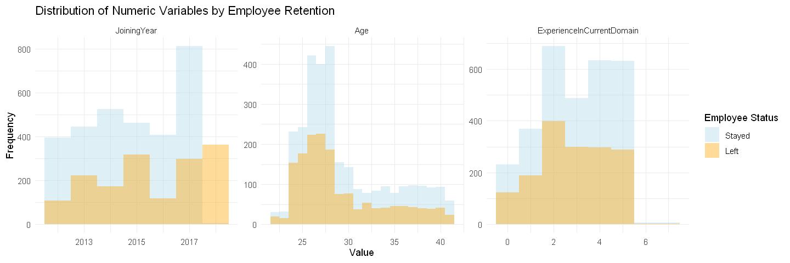
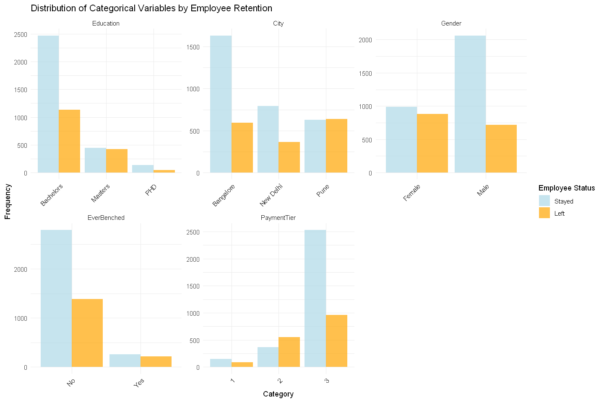
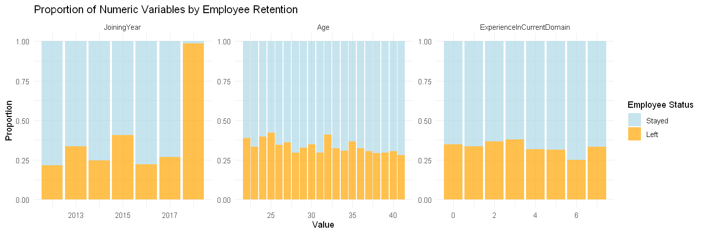
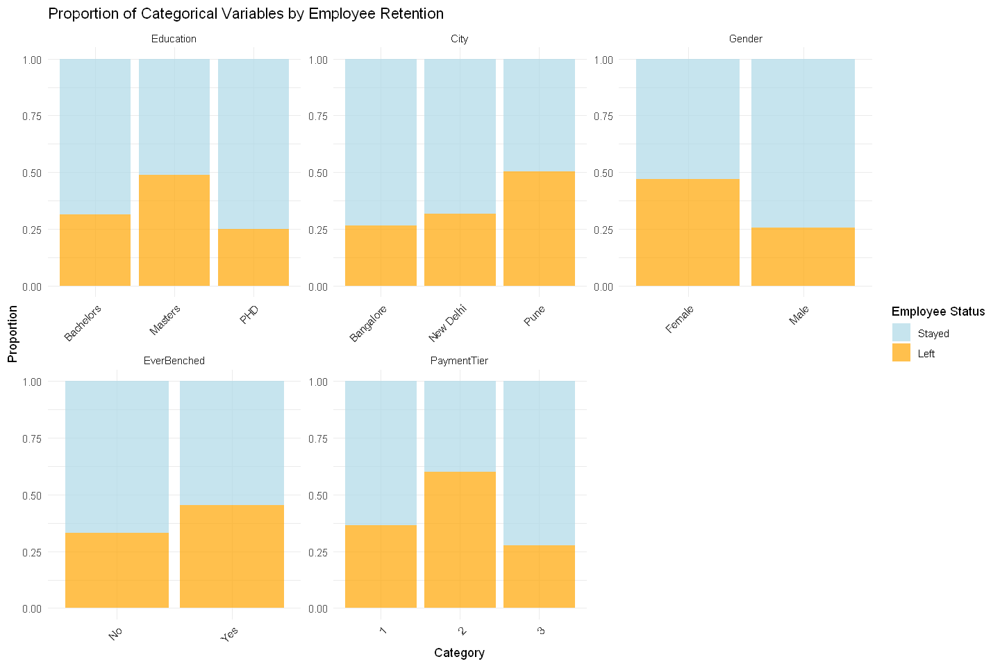

# 📊 Employee Attrition Prediction – Data Science Project

## 📌 Overview
This project analyzes **employee attrition** to identify key factors influencing turnover. Using **R** for statistical modeling and visualization, we explore how factors like **salary tier, tenure, and work assignment (benching)** impact attrition. The goal is to build a **predictive model** that helps HR teams anticipate and reduce employee turnover.

### 🎯 **Objectives**
- Analyze **employee attrition patterns** using HR data.
- Identify key drivers of employee turnover.
- Develop a **predictive model** using **Logistic Regression & Lasso Regression**.
- Visualize insights using **ggplot2 & GGally**.
- Provide **actionable insights** for HR decision-making.

---

## 🛠️ **Tools & Technologies**
- **Language:** R  
- **Libraries:** `tidyverse`, `ggplot2`, `dplyr`, `caret`, `glmnet`, `MASS`, `pROC`, `GGally`  
- **Modeling Techniques:** Logistic Regression, Lasso Regression  
- **Visualization:** ggplot2, correlation matrix, feature importance plots  
- **Dataset:** [Kaggle HR Employee Dataset](https://www.kaggle.com/datasets/tawfikelmetwally/employee-dataset)  

---

## 📊 **Key Insights**
✅ **Salary tier** significantly affects attrition—lower-tier employees leave more frequently.  
✅ Employees who were **"benched" (without assigned work)** had a **higher probability of leaving**.  
✅ The **Lasso Regression model** improved feature selection, highlighting key attrition factors.  
✅ The predictive model achieved an **accuracy of 73.41%**.  

---

## 🔍 **How to Run the Project**
1. **Clone the repository**:
   ```sh
   git clone https://github.com/yourusername/Employee-Attrition-Prediction.git
   cd Employee-Attrition-Prediction
   ```

2. **Install dependencies in R**:
   ```r
   install.packages(c("tidyverse", "broom", "dplyr", "ggplot2", "MASS", "caret", "pROC", "glmnet", "GGally"))
   ```

3. **Open & Run `Final Report.ipynb` in Jupyter or RStudio**.

---

## 📈 **Example Visualizations**





---

## 🚀 **Future Improvements**
🔹 Experiment with **Random Forest & XGBoost models** for better accuracy.  
🔹 Implement **SHAP (SHapley Additive Explanations)** for feature impact interpretation.  
🔹 Create a **Power BI dashboard** for HR teams to interactively explore attrition trends.  

---
